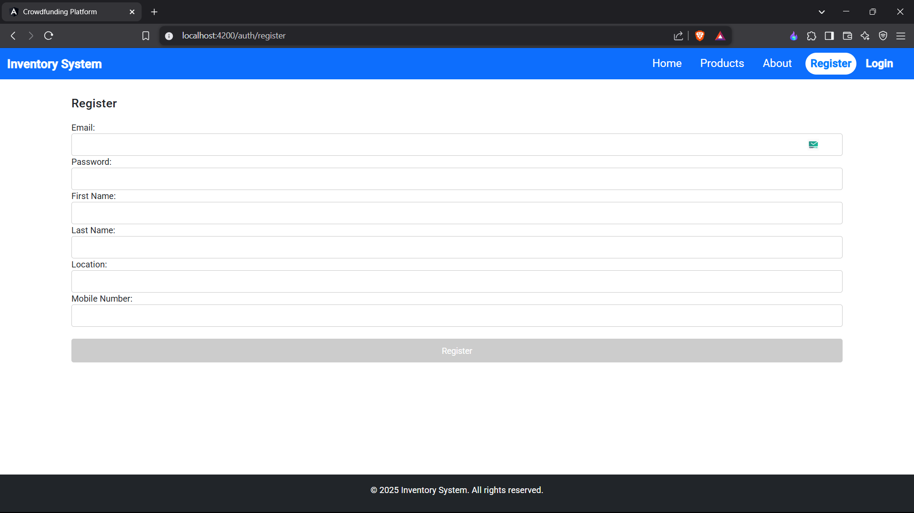

# AngularJest

This project was generated with [Angular CLI](https://github.com/angular/angular-cli) version 15.0.0.
# **Angular Product Inventory Management** 🚀  

This is a **web-based product inventory management system** built using **Angular 15**. It allows users to **add, update, view, and delete products**. The project follows a **modular architecture** with **lazy loading**, and uses **JSON Server** as a mock backend.

---

## **📌 Features**
✅ **Product Management** – Add, view, edit, and delete products  
✅ **Search Functionality** – Quickly find products by name  
✅ **Authentication** – Restricts product deletion to logged-in users  
✅ **Mock Backend** – Uses **JSON Server** for API simulation  
✅ **Angular Material & Bootstrap UI** – Modern responsive design  
✅ **Jest Testing** – Unit tests for key components  

## **⚙️ Installation & Setup**

### **1️⃣ Prerequisites**
Ensure you have the following installed:  
- **Node.js (v16+)** – [Download](https://nodejs.org/)  
- **Angular CLI (v15.0.0)** – Install via:
  ```bash
  npm install -g @angular/cli
  ```

  ## Screenshots 📸


### **Product List**

## Screenshots 📸


### **Login Page**


### **Register Page**


### **Add Product**


### **View Product**


### **2️⃣ Clone the Repository**
```bash
git clone https://github.com/your-username/lab-angular-main.git
cd lab-angular-main
```

### **3️⃣ Install Dependencies**
```bash
npm install
```

### **4️⃣ Start the Mock Backend (JSON Server)**
```bash
npm run json-server
```

### **5️⃣ Run the Angular App**
```bash
npm run start
```
Open **http://localhost:4200** in your browser.  

---

## **📜 API Endpoints (JSON Server)**
| Method | Endpoint          | Description           |
|--------|------------------|----------------------|
| GET    | `/products`      | Fetch all products  |
| POST   | `/products`      | Add a new product   |
| PUT    | `/products/:id`  | Update a product    |
| DELETE | `/products/:id`  | Delete a product    |

---

## **🛠️ Built With**
- **Angular 15**
- **RxJS** (Reactive Programming)
- **Bootstrap 5.3.3**
- **JSON Server** (Mock API)
- **Jest** (Unit Testing)
  

---
Arijit Basak
